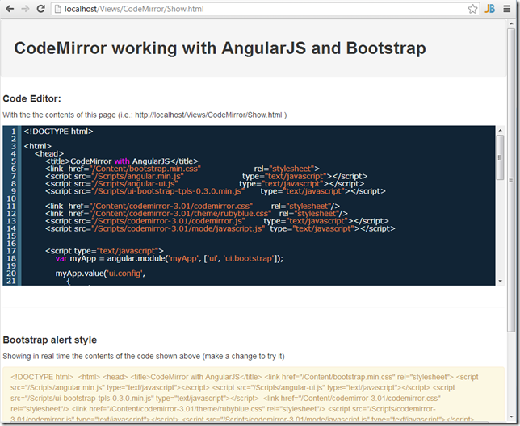
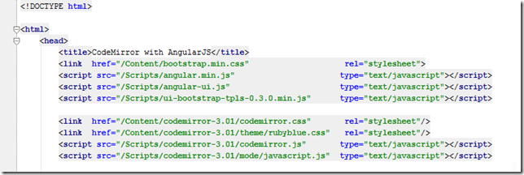
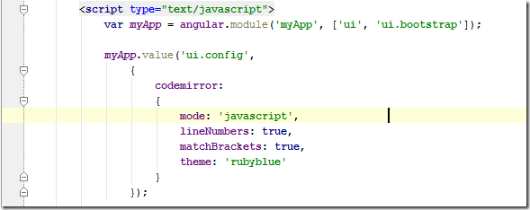

##  AngularJS code editor using UI-Bootstrap and CodeMirror (done without using jQuery)

I'm adding a number of [AngularJS](http://docs.angularjs.org/) views to [TeamMentor](http://blog.diniscruz.com/search/label/TeamMentor), and here is a simple HTML based source code editor inspired on the [How to Integrate Codemirror With Angular UI](http://neverstopbuilding.net/how-to-integrate-codemirror-with-angular-ui/) post and [ui-codemirror](https://github.com/angular-ui/ui-codemirror) repository.

In the end, these are the APIs I used:  

  * [http://angularjs.org/](http://angularjs.org/)
  * [http://angular-ui.github.io/bootstrap/](http://angular-ui.github.io/bootstrap/)
  * [http://twitter.github.io/bootstrap](http://twitter.github.io/bootstrap)
  * [http://codemirror.net/](http://codemirror.net/) (just the core bit)

And this is what it looks like:

The source code editor is showing the contents of the current page (dynamically fetched using Angular **_$http.get_**) and the bottom yellow div is showing (in real-time) the contents of the source code editor:

**What is nice about this example is that I didn't use jQuery at all!**

The great posts [http://stackoverflow.com/a/15012542](http://stackoverflow.com/a/15012542) and [AngularJS for jQuery Developers](http://blog.artlogic.com/2013/03/06/angularjs-for-jquery-developers/) explain why learning to code in Angular without JQuery is so important.

Basically, it's better not  have jQuery available, since them, the only way to solve a problem, is the 'AngularJS way' :)

**How it works:**  

Here is a brief explanation of the code behind this PoC (included in full at the end of this page):

First we load the **Javascript** and **CSS:**  

... them set up **_AngularJS_** module and **_codeMirror_** value

... use a **_controller_** to get the code to show (using **_$http.get_**) and assign it to the the**_ $scope.code_** variable

... configure **angularJS** in the HTML by setting the **_textarea_** element to be a **_codemirror_** (linked to the **$scope.code** model)

... finally show the current value of **$scope.code** in side an bootstrap **_alert_** element

**Complete Source code:**  

{lang="csharp"}
    <!DOCTYPE html>

    <html>  
        <head>  
            <title>CodeMirror with AngularJS</title>  
            <link href="/Content/bootstrap.min.css" rel="stylesheet">  
              
              
            

            <link href="/Content/codemirror-3.01/codemirror.css" rel="stylesheet"/>  
            <link href="/Content/codemirror-3.01/theme/rubyblue.css" rel="stylesheet"/>  
              
            

              
        </head>  
        <body ng-app="myApp">  
            
  
                
  
                    <h2>CodeMirror working with AngularJS and Bootstrap</h2>
  
                
  
                
  
                    

                    <h4>Code Editor:</h4>  
                    
With the the contents of this page (i.e.: {{docLocation}} )

                    <textarea ui-codemirror ng-model="code"></textarea>

                     
 

                    <h4>Bootstrap alert style</h4>  
                    
  
                        Showing in real time the contents of the code shown above (make a change to try it)  
                    
  
                    <alert type="success">{{code}}</alert>  
                
  
            
  
        </body>  
    </html>  
