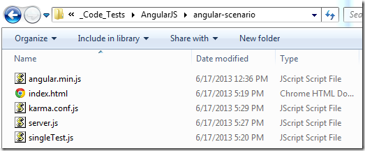
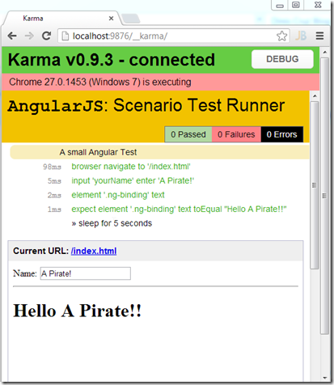
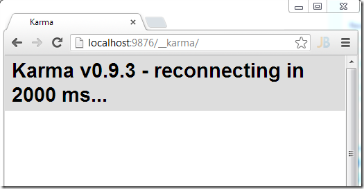

## A small AngularJS Jasmine test executed by KarmaJS

When I try to understand how a particular technology works I always like to create a simple test case with a small number of moving parts.

This post shows such example for an AngularJS page, a Jasmine test, a NodeJS web server and a KarmaJS execution cycle.

The files used/customised were based on the KarmaJS [test/e2e/angular-scenario ](https://github.com/karma-runner/karma/tree/master/test/e2e/angular-scenario)example:  

Let's look at each file's contents and what they do  

1) **angular.min.js** is the latest version of AngularJS

2) **index.html** is a simple AngularJS example:  

{lang="html"}
    <!DOCTYPE html>  
    <html xmlns:ng="http://angularjs.org" id="ng-app" ng-app>  
    <head>  
      <meta charset="utf-8">    
      <title>Sample Angular App</title>  
        
    </head>  
    <body>  
      
  
        <label>Name:</label>  
        <input type="text" ng-model="yourName" placeholder="Enter a name here">  
        
  
        <h1>Hello {{yourName}}!</h1>  
      
  
    </body>  
    </html>

3) **karma.conf.js** is a reduced to the normal KarmaJS config file  

{lang="javascript"}
    module.exports = function(karma)   
        {  
            karma.configure(  
                  {  
                    // generic  
                    frameworks    : ['ng-scenario'],                          
                    urlRoot        : '/__karma/',          
                    autoWatch    : true,                                  
                    plugins     : ['karma-ng-scenario'],

                    //project specific  
                    proxies : { '/': 'http://localhost:8000/'},   
                    files : ['singleTest.js'],

                    //run specific   
                    singleRun : true,   
                  });  
        };  

4) **singleTest.js** checks if AngularJS is working as expected  

{lang="javascript"}
    /** A Sample Angular E2E test */

    describe('SimpleTest', function()
    {

        it('A small Angular Test', function()
            {  
                browser().navigateTo('/index.html');  
                input('yourName').enter('A Pirate!');  
                expect(element('.ng-binding').text()).toEqual('Hello A Pirate!!');  
            });   
    });  

5) **server.js** is a working Web NodeJS server (also reduced for easier reading):

{lang="javascript"}
    var sys = require('sys'),  
        http = require('http'),  
        fs = require('fs'),  
        url = require('url'),  
        events = require('events');

    var DEFAULT_PORT = 8000;

    function main(argv)
    {  
        new HttpServer({  
                            'GET': createServlet(StaticServlet),  
                            'HEAD': createServlet(StaticServlet)  
                        }).start(Number(argv[2]) || DEFAULT_PORT);  
    }

    function escapeHtml(value)
    {  
        return value.toString().  
        replace('<', '&lt;').  
        replace('>', '&gt').  
        replace('"', '&quot;');  
    }

    function createServlet(Class)
    {  
        var servlet = new Class();  
        return servlet.handleRequest.bind(servlet);  
    }

    /**  
    * An Http server implementation that uses a map of methods to decide  
    * action routing.  
    *  
    * @param {Object} Map of method => Handler function  
    */  
    function HttpServer(handlers)
    {  
        this.handlers = handlers;  
        this.server = http.createServer(this.handleRequest_.bind(this));  
    }

    HttpServer.prototype.start = function(port) {  
        this.port = port;  
        this.server.listen(port);  
        sys.puts('Http Server running at http://127.0.0.1:' + port + '/');  
    };

    HttpServer.prototype.parseUrl_ = function(urlString) {  
        var parsed = url.parse(urlString);  
        parsed.pathname = url.resolve('/', parsed.pathname);  
        return url.parse(url.format(parsed), true);  
    };

    HttpServer.prototype.handleRequest_ = function(req, res)
    {  
        var logEntry = req.method + ' ' + req.url;  
        if (req.headers['user-agent'])
        {  
            logEntry += ' ' + req.headers['user-agent'];  
        }  
        sys.puts(logEntry);  
        req.url = this.parseUrl_(req.url);  
        var handler = this.handlers[req.method];  
        if (!handler)
        {  
            res.writeHead(501);  
            res.end();  
        } else
        {  
        handler.call(this, req, res);  
        }  
    };

    /**  
    * Handles static content.  
    */  
    function StaticServlet() {}

    StaticServlet.MimeMap =
        {  
            'txt': 'text/plain',  
            'html': 'text/html',  
            'css': 'text/css',  
            'xml': 'application/xml',  
            'json': 'application/json',  
            'js': 'application/javascript',  
            'jpg': 'image/jpeg',  
            'jpeg': 'image/jpeg',  
            'gif': 'image/gif',  
            'png': 'image/png',  
            'manifest': 'text/cache-manifest'  
        };

    StaticServlet.prototype.handleRequest = function(req, res)
        {  
            var self = this;  
            var path = ('./' + req.url.pathname).replace('//','/').replace(/%(..)/g, function(match, hex)
                {  
                    return String.fromCharCode(parseInt(hex, 16));  
                });     
            var parts = path.split('/');

            fs.stat(path, function(err, stat)
                {  
                    if (err)  
                        return self.sendMissing_(req, res, path);  
                    return self.sendFile_(req, res, path);  
                });  
        };

    StaticServlet.prototype.sendFile_ = function(req, res, path)
        {  
            var self = this;  
            var file = fs.createReadStream(path);  
            res.writeHead(200,
            {  
                // CSP headers, uncomment to enable CSP  
                //"X-WebKit-CSP": "default-src 'self';",  
                //"X-Content-Security-Policy": "default-src 'self'",  
                'Content-Type': StaticServlet.  
                MimeMap[path.split('.').pop()] || 'text/plain'  
            });  
            if (req.method === 'HEAD')
            {  
                res.end();  
            } else
            {  
                file.on('data', res.write.bind(res));  
                file.on('close', function()
                {  
                    res.end();  
                });  
                file.on('error', function(error)
                {  
                    self.sendError_(req, res, error);  
                });  
            }  
        };

    StaticServlet.prototype.sendError_ = function(req, res, error)
        {  
            res.writeHead(500, {  
                                    'Content-Type': 'text/html'  
                               });  
            res.write('<!doctype html>\n');  
            res.write('<title>Internal Server Error</title>\n');  
            res.write('<h1>Internal Server Error</h1>');  
            res.write('<pre>' + escapeHtml(sys.inspect(error)) + '</pre>');  
            sys.puts('500 Internal Server Error');  
            sys.puts(sys.inspect(error));  
        };

    StaticServlet.prototype.sendMissing_ = function(req, res, path)
        {  
            path = path.substring(1);  
            res.writeHead(404, {  
                                    'Content-Type': 'text/html'  
                                });  
            res.write('<!doctype html>\n');  
            res.write('<title>404 Not Found</title>\n');  
            res.write('<h1>Not Found</h1>');  
            res.write('
The requested URL ' + escapeHtml(path) +  
                      ' was not found on this server.
');  
            res.end();  
            sys.puts('404 Not Found: ' + path);  
        };

    // Must be last,  
    main(process.argv);  

**To see this in action**

**1) start the web server** using **_start node server.js_**

**2) start karm**a with **_karma start karma.confi.js_**

**3) on a local browser open [http://localhost:9876/__karma](http://localhost:9876/__karma) which will execute the test

Since we have **singleRun **set to** true **(in **_karma.conf.js_**), the karma process ends after each execution, which means that the captured browsers will go into a 'wait state' (i.e. waiting for another karma server to come back to life)

**4) notice that back in karma, the tests executed ok:**

So here it is, a petty small example of a really powerful combination of technologies (and UnitTests workflows)

**NOTE: while creating this post, I wrote an O2 Platform C# script to help**

this script created a nice integrated test UI

]

Which allowed me to (in the same window) make changes and see its impact

**C# script of UI shown above**  

{lang="csharp"}
    var topPanel = "PoC - Karma and Angular run".popupWindow(1200,700);  
    //var topPanel = panel.clear().add_Panel();  
    //var textBox = topPanel.clear().add_RichTextBox();  
    var codeDir  = @"E:\_Code_Tests\AngularJS\angular-scenario";  
    var karma      = @"C:\Users\o2\AppData\Roaming\npm\node_modules\karma\bin\karma";

    var testPage = "http://localhost:8000/index.html";   
    var testRunner = "http://localhost:9876/__karma/";

    var karmaConfig = codeDir.pathCombine("karma.conf.js");  
    var serverConfig = codeDir.pathCombine("server.js");  
    var unitTestFile = codeDir.pathCombine("e2eSpec.js");

    Process karmaProcess = null;

    Action startWebServer =   
        ()=>{  
                Processes.startProcessAndRedirectIO("node", serverConfig,codeDir,(line)=>line.info());   
            };

    Action runKarma =   
        ()=>{  
                Action<string> consoleOut =   
                    (consoleLine)=> consoleLine.info(); //textBox.append_Line(consoleLine);

                var command = "start \"{0}\" ".format(karmaConfig);  
                karmaProcess = "node".startProcess("\"" + karma + "\" " + command, consoleOut);   
            };

    if (testPage.GET().notValid())  
    {  
        "Staring WebServer".info();  
        startWebServer();  
        1000.wait();  
    }  

    var toolStrip = topPanel.insert_Above_ToolStrip();  
    var codeEditor_Test = topPanel.add_SourceCodeEditor();  
    var ie_UnitTestRunner = codeEditor_Test.insert_Right().add_WebBrowser_with_NavigationBar();  
    var ie_Site = ie_UnitTestRunner.insert_Below().add_WebBrowser_with_NavigationBar();  
    var codeEditor_Config = codeEditor_Test.insert_Below().add_SourceCodeEditor();

    codeEditor_Test.open(unitTestFile);  
    codeEditor_Config.open(karmaConfig);  
    ie_Site.open(testPage);  
    ie_UnitTestRunner.open(testRunner);  
    toolStrip.add_Button("Run","btExecuteSelectedMethod_Image".formImage(),()=>runKarma());

    runKarma();

    //using System.Diagnostics
