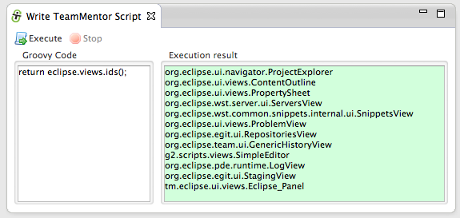
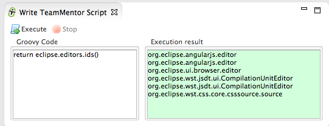
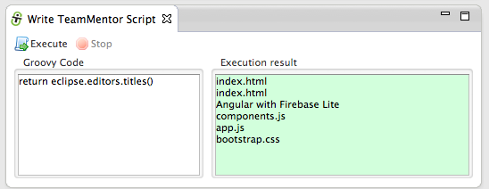
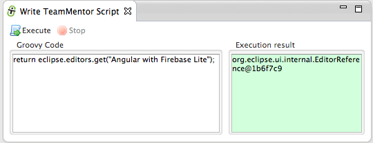
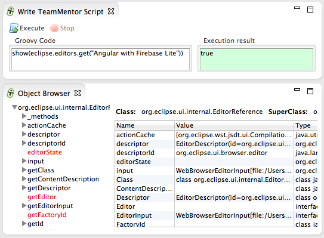
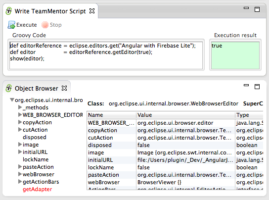
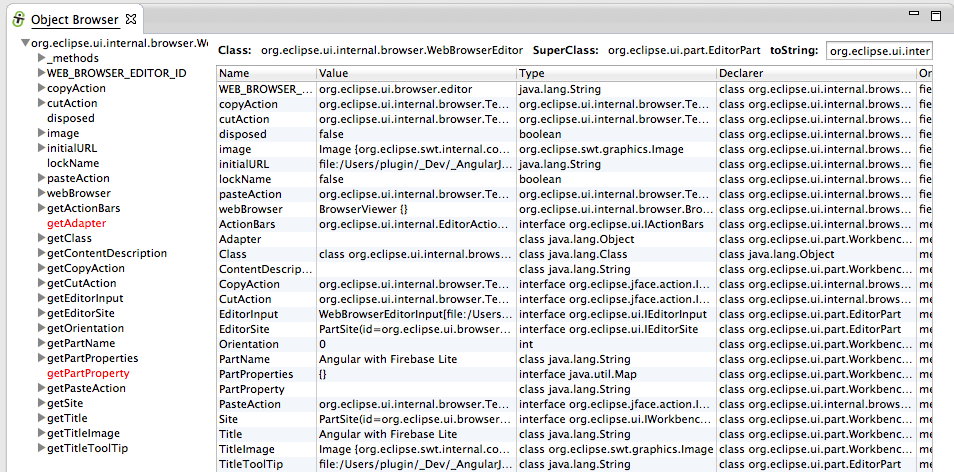
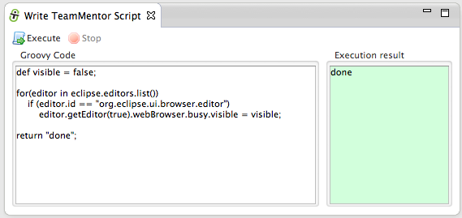

##  Eclipse Groovy script to remove the 'busy' image from the WebBrowser Editor

Now that I'm doing [AngularJS](http://blog.diniscruz.com/search/label/AngularJS) and [Firebase](http://blog.diniscruz.com/search/label/Firebase) development inside Eclipse, there was a little 'thing' that was starting to drive me crazy: **_The animation icon on the top right of the Eclipse WebBrowser!_**  

Apart from the [mosaic](http://en.wikipedia.org/wiki/Mosaic_(web_browser)) 2000s look (which is kinda ok), there is a big problem with pages that keep running for a while: **_the animation doesn't stop!_**  

This means that if you are developing inside Eclipse, there is this 'thing' (i.e. the top right icon) that keeps moving and demand my brain's attention:  

Since there didn't seem to be an preference or option to disable this behavior, it was time to open up the [Eclipse Grovy REPL Scripting Environment](https://marketplace.eclipse.org/content/eclipse-grovy-repl-scripting-environment) and fix it with a script :)

**The solution**

After a quick prototyping, I come up with this script to remove all icons from all opened WebBrowser editors ([gist here](https://gist.github.com/DinisCruz-Dev/9294163)):

After execution the icon is not there anymore :)

**How I found the solution**

Here are the steps I took to find the _busy _object to set the **_visible_** value to false

1) in the [Grovy REPL](https://marketplace.eclipse.org/content/eclipse-grovy-repl-scripting-environment) I started by getting a list the **_ids_** of all current opened Eclipse views, but there didn't seem to be any web browser in there:

2) then I looked at the list the **_ids_** of all current opened editors, and found one that sounded promising:  **org.eclipse.ui.browser.editor**

3) to confirm that that was the one I wanted, I looked at the **_titles_** of the current editors, and confirmed that the browser window I want to capture was there (the title was "_Angular with Firebase Lite_");

4) now that I knew the title, it was easy to get an **_EditorReference_** to it:

5) everytime I have an object reference that I want to take a look, I call the _show({object})_ viewer, since that will give me a nice **_TreeViewer_** of all methods, fields and properties ( see [Viewing Eclipse and SWT objects (Workbench, Display and Shell) using Groovy's ObjectBrowser and using TeamMentor's Plugin ObjectBrowser](http://blog.diniscruz.com/2014/01/viewing-eclipse-and-swt-objects.html) for more details how this works)

6) in this case we don't want the _EditorReference_ object. What we really want is the actually editor, which can be retrieved by invoking the **_getEditor(true)_** method (note how the object we are currently seeing in the **_Object Browser_** is the **_org.eclipse.ui.internal.WebBrowserEditor_**)

Here is a better view of this object:

7) looking at the **org.eclipse.ui.internal.WebBrowserEditor** object, the one that called my attention was the **_webBrowser_** field (which is an **_org.eclipse.ui.internal.browser.BrowserViewer_** object)

8) Inside the **_webBrowser_** object I found the **_busy_** field (which is an **_org.eclipse.ui.internal.browser.BusyIndicator_** object)

9) and finally inside the **busy** object I found the **_visible_** property (ie the **_getVisible_** and **setVisible** methods)

10) back in the REPL, it was time to do the same thing programmatically.

First I got a reference to the **_webBrowser_** field:

... and then the **_busy_** field:

11) Once I had the reference to the **_busy_** field, it was easy to make it invisible (by just setting the **_visible_** property to **_false_**)

12) final step was to write a generic script that would work on all opened browser editor windows (a robust script would use the same trick I used in the integration with the Fortify plugin, where a callback is received on every new view opened (i.e. we could wait for new instances of the **org.eclipse.ui.browser.editor** to be opened, and apply the fix then))

To demonstrate the script in action, here it is the browser before:

... and here it is after:

Note: another way to to stop the constant animation was to just set the **_stop_** value to _false_, but this would only work for the current opened page (i.e. the animation would be back on page reload)

