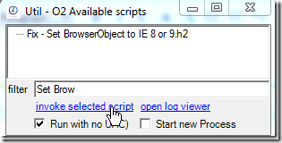

## If AngularJS doesn't work on your O2 Platform IE scripts (the fix is to change browser compatibility mode)

If when trying to open an AngularJS page inside an O2 Platform script, you see:

... this means that the IE browser embedded in that .NET process is set to run under IE 7  

To confirm it, try opening the [http://www.whatismybrowser.com](http://www.whatismybrowser.com/) and you should see something like:

As mentioned in the [set .NET WebBrowser Control to use latest version of IE](http://o2platform.wordpress.com/2012/04/17/set-net-webbrowser-control-to-use-latest-version-of-ie/)  post to. change it on your system, run this script

... as admin with no UAC

...and now after restarting the O2 Platform process, IE should be on Internet **Explorer 9 compatibility mode**  

... and AngularJS should work:

**Note 1:** if you control the site you are testing, you can also add this also works to make it work (with the advantage that it is not exe specific)

{lang="html"}   
    <meta http-equiv="X-UA-Compatible" content="IE=EmulateIE9" />
