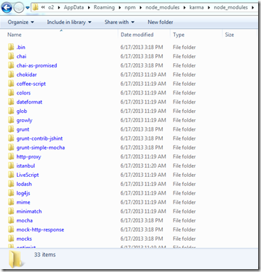

## Debugging a weird case of missing module in AngularJS and KarmaJS

When I was trying the  [Running KarmaJS's AngularJS example test/e2e/angular-scenario (on Chrome)](http://blog.diniscruz.com/2013/06/running-karmas-angularjs-example.html) I hit on the the following weird behaviour.

TLDR; the solution was to run **_npm install --g _****_karma@canary_**  
  
**Setup**  
**  
**Chrome window opened in:

... a local website at port 8000:

... which is a nodeJS powered website, started using **_node server.js_** (below)

A simple (as I could make it)**_ Karma.config.js _**file

.... and AngularJS test

   
**  
****Scenario A) Running from folder with karma clone (and npm install)**  
**  
****_karma start ..\angular-scenario\karma.conf.js _**works OK

**Scenario B) running from parent folder**  
**  
****_karma start angular-scenario\karma.conf.js _**fails with a **_module is not defined error_**  
**_  
_**

So what I think is happening is that because I run**_ npm install_** on the karma folder (the one I got from a GitHub clone), there are more modules in there than in the global karma (which I got when I installed karma using **_npm install --g karma_**)

At the moment there are 49 modules in the GitHub karma:

And 20 modules in the global karma install

So let's try running npm install on this folder

   

And now there are 33 modules installed:

but that still didn't work :(

At this stage I remembered reading something about installing the latest version of karma (globally), which is probably what I'm getting from the github clone, and that could explain the different number of modules.

So I executed **_npm install --g _****_karma@canary_**  
**_  
_**   
which installed ok:  

Now runnig the **scenario B) **case throws a different error:

It looks that we also need install the **_karma-ng-scenario_** module

And now it works :)

- - - - 
[Table of Contents](../Table_of_contents.md) | [Code](../Code)